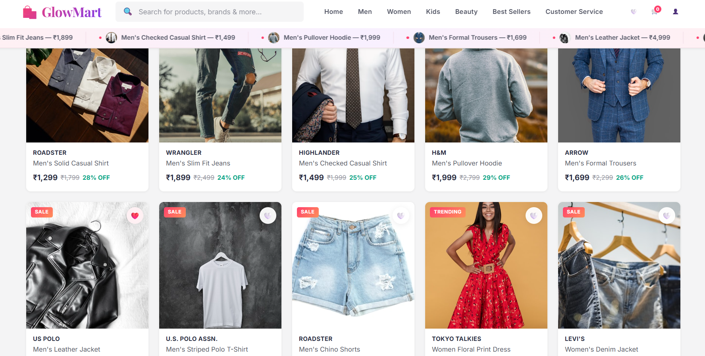

# 🛍️ GlowMart E-Commerce Store



Welcome to **GlowMart** — a premium, full-stack e-commerce web application featuring a stunning dark-mode "glassmorphism" user interface with vibrant neon accents.

<div align="center">
  <a href="https://glowmart-ubsx.onrender.com">
    
  </a>
</div>

*GlowMart's homepage features pastel-colored category cards with black text for a vibrant, easy-to-read shopping experience.*

## ✨ Features

- **Modern UI/UX**: Custom-built CSS featuring frosted glass cards, dynamic gradient backgrounds, and beautiful layout animations.
- **Full Authentication**: Secure user registration, login, and JWT-based session management.
- **Global Auth Guard**: Automatically redirects unauthenticated users trying to access protected store routes.
- **Product Catalog**: Dynamic product rendering with category filtering, search functionality, and a beautiful scrolling marquee.
- **Cart & Wishlist**: Persistent cart and wishlist management using local storage.
- **Checkout Flow**: Seamless checkout process with dynamic delivery and payment options.
- **Order Management**: Users can view their complete order history with colorful status badges on their profile page.
- **Backend Architecture**: Powered by Express.js (Node.js) with a robust PostgreSQL database handling products, users, and orders.

## 🚀 Tech Stack

- **Frontend**: HTML5, Vanilla JavaScript, CSS3 (Custom Glassmorphism Design System)
- **Backend**: Node.js, Express.js
- **Database**: SQLite
- **Authentication**: JSON Web Tokens (JWT), bcrypt

## 🛠️ Getting Started

### Prerequisites
- Node.js (v14 or higher)
- npm

### Installation
1. Clone the repository:
   ```bash
   git clone https://github.com/sankri15/ecommerce-store.git
   ```
2. Navigate to the project directory:
   ```bash
   cd ecommerce-store
   ```
3. Install the dependencies:
   ```bash
   npm install
   ```
4. Start the development server:
   ```bash
   npm run dev
   ```
5. Open your browser and navigate to `http://localhost:3000`

## 👨‍💻 Created By

**Sanjana Pal**
- ✉️ sanjanapal004@gmail.com
- 💼 [linkedin.com/in/sanjpal](https://www.linkedin.com/in/sanjpal)
